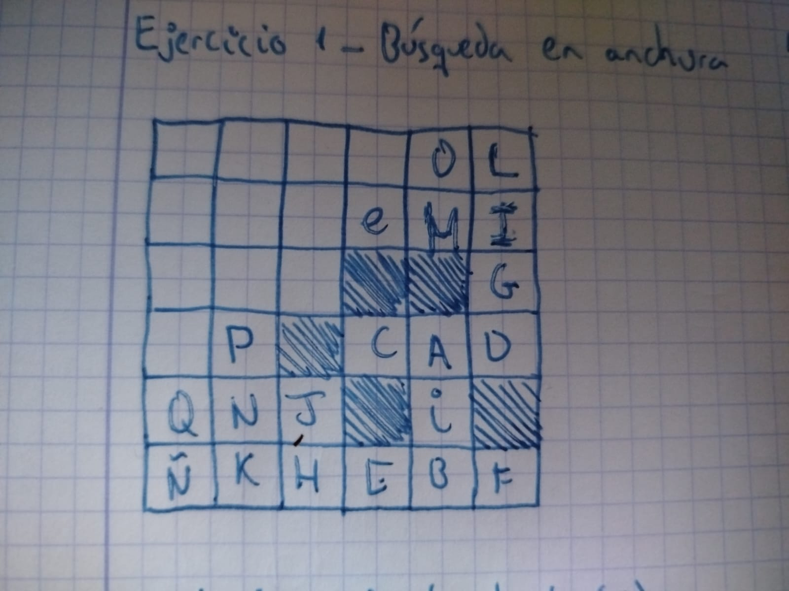
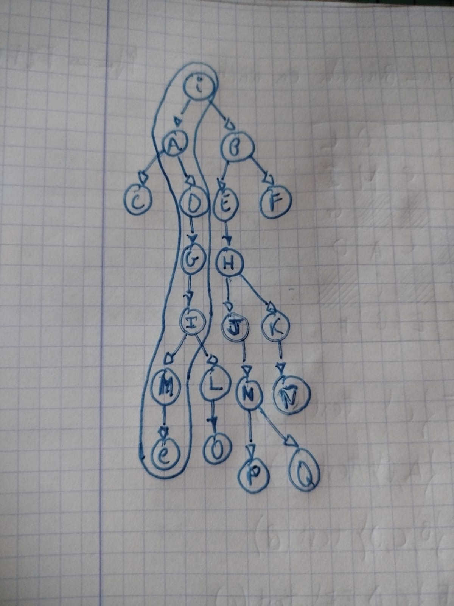
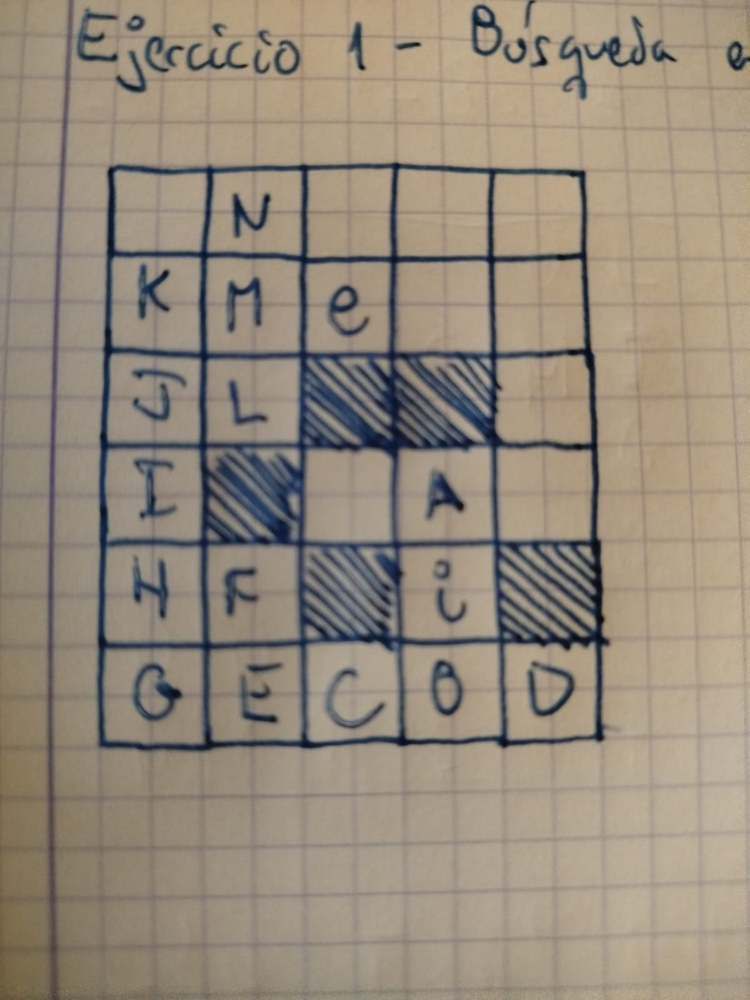
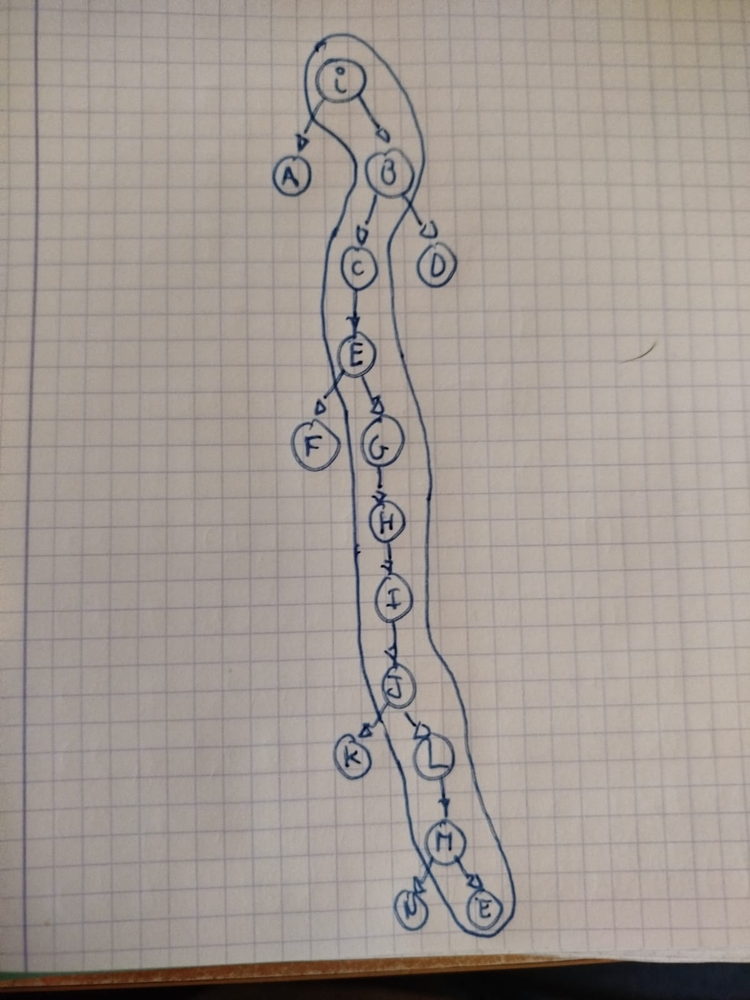
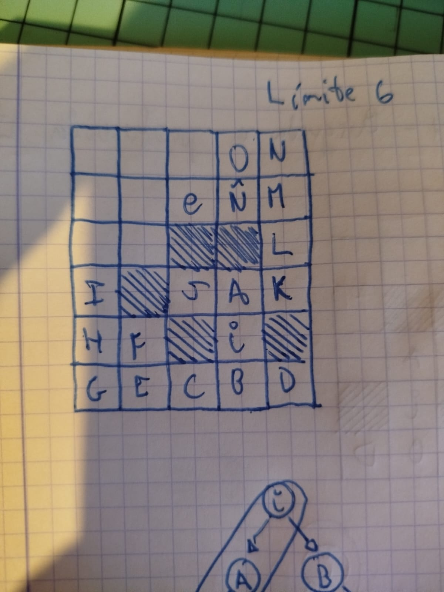
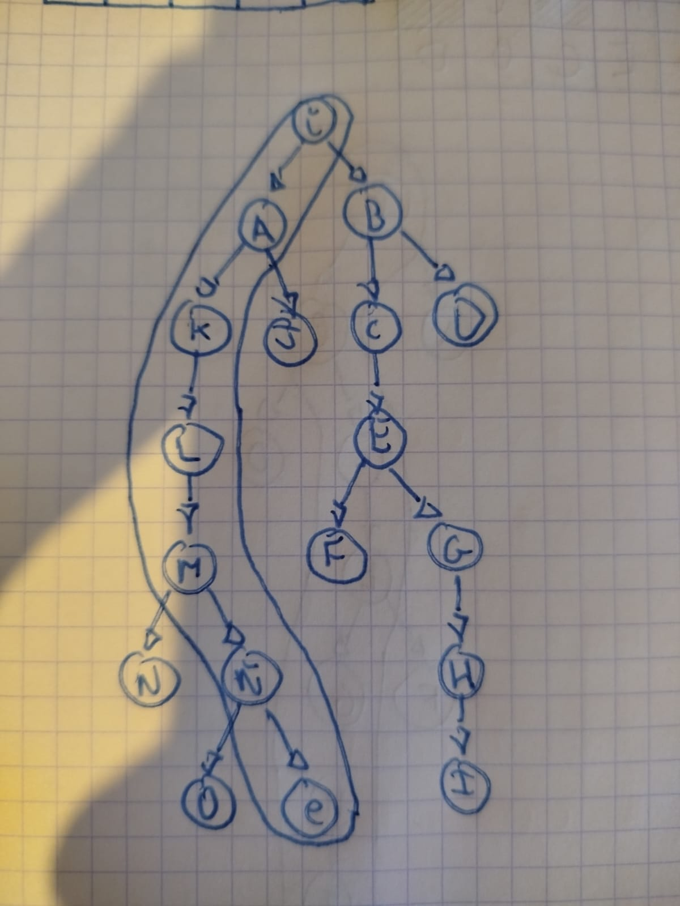
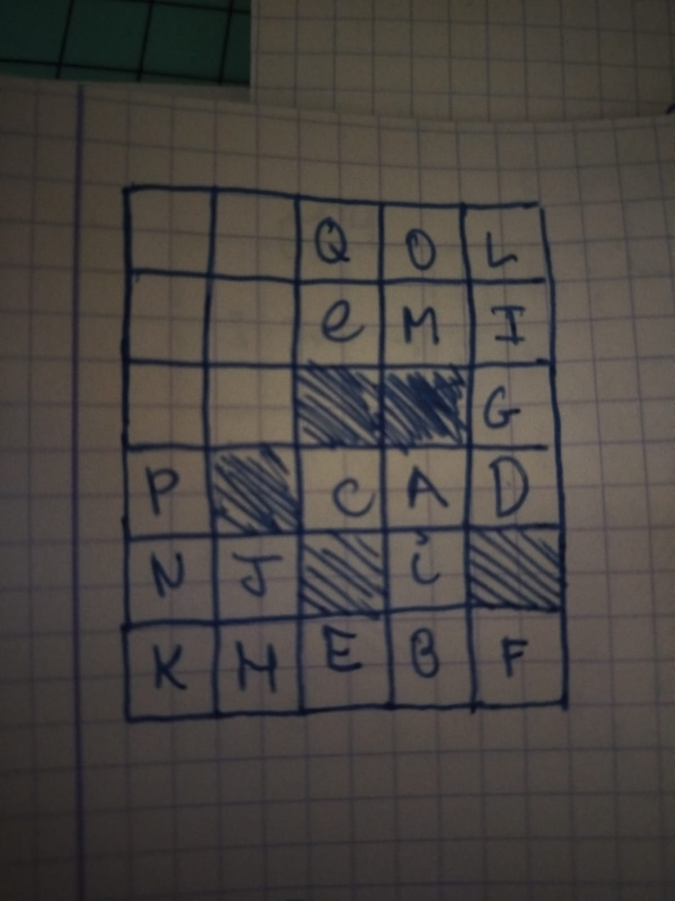
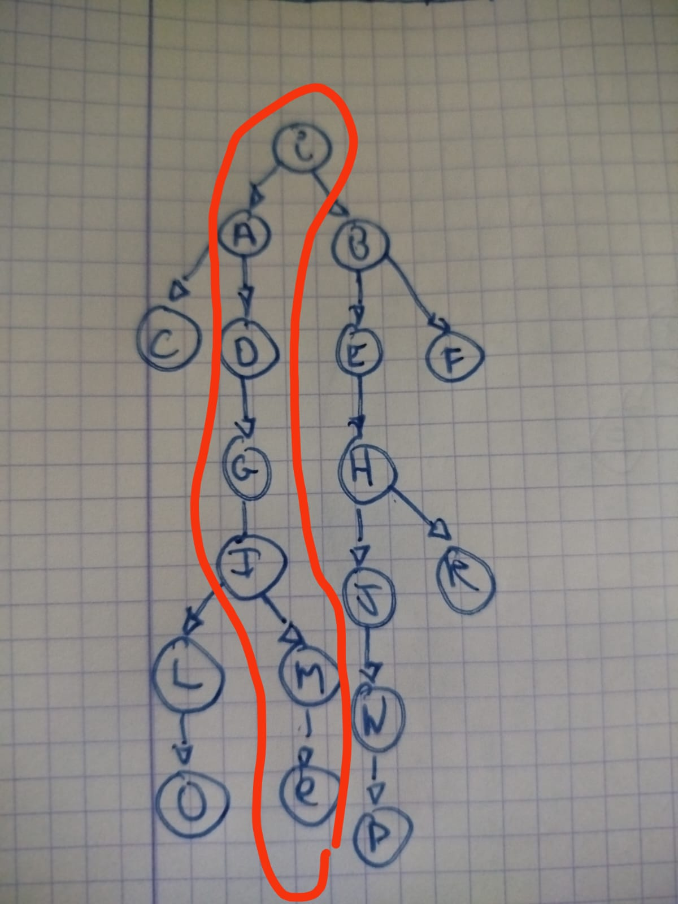
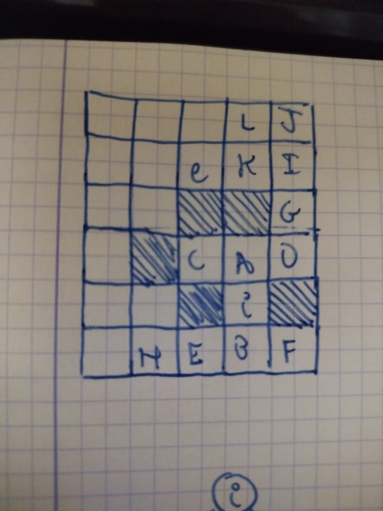
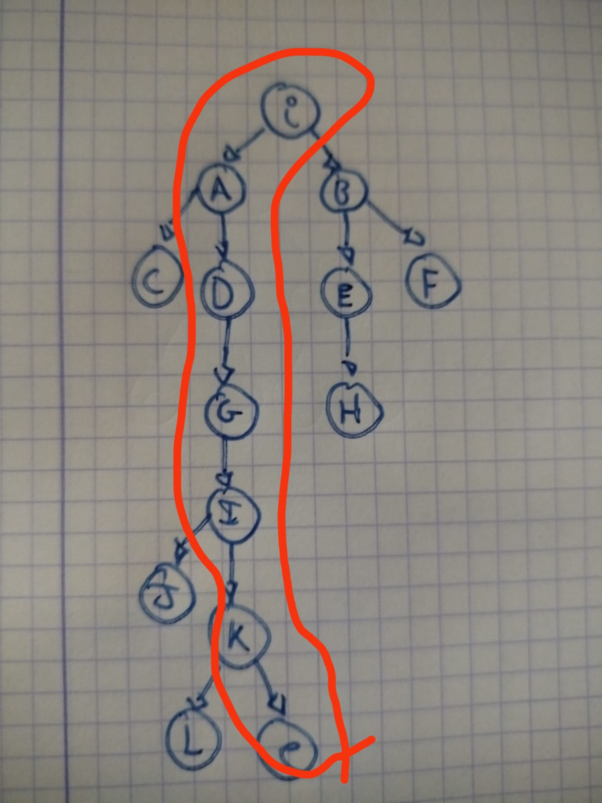

# Ejercicio 1

## Mediante __búsqueda en anchura__

- C {0} F {i} test(i)
- C {i} F {A,B} test(A)
- C {i,A} F {B,C,D} test(B)
- C {i,A,B} F {C,D,E,F} test(C)
- C {i,A,B,C} F {D,E,F} test(D)
- C {i,A,B,C,D} F {E,F,G} test(E)
- C {i,A,B,C,D,E} F {F,G,H} test(F)
- C {i,A,B,C,D,E,F} F {G,H} test(G)
- C {i,A,B,C,D,E,F,G} F {H,I} test(H)
- C {i,A,B,C,D,E,F,G,H} F {I,J,K} test(I)
- C {i,A,B,C,D,E,F,G,H} F {J,K,L,M} test(J)
- C {i,A,B,C,D,E,F,G,H,J} F {K,L,M,N} test(K)
- C {i,A,B,C,D,E,F,G,H,J,K} F {L,M,N,Ñ} test(L)
- C {i,A,B,C,D,E,F,G,H,J,K,L} F {M,N,Ñ,O} test(M)
- C {i,A,B,C,D,E,F,G,H,J,K,L,M} F {N,Ñ,O,e} test(N)
- C {i,A,B,C,D,E,F,G,H,J,K,L,M,N} F {Ñ,O,e,P,Q} test(Ñ)
- C {i,A,B,C,D,E,F,G,H,J,K,L,M,N,Ñ} F {O,e,P,Q} test(O)
- C {i,A,B,C,D,E,F,G,H,J,K,L,M,N,Ñ,O} F {e,P,Q} test(e) -> es el objetivo

### Árbol de decisión:

## Mediante __búsqueda en profundidad__ (SIN LÍMITE)

- C {0} F {i} test(i)
- C {i} F {A,B} test(B)
- C {i,B} F {A,C,D} test(D)
- C {i,B,D} F {A,C} test(C)
- C {i,B,D,C} F {A,E} test(E)
- C {i,B,D,C,E} F {A,F,G} test(G)
- C {i,B,D,C,E,G} F {A,F,H} test(H)
- C {i,B,D,C,E,G,H} F {A,F,I} test(I)
- C {i,B,D,C,E,G,H,I} F {A,F,J} test(J)
- C {i,B,D,C,E,G,H,I,J} F {A,F,K,L} test(L)
- C {i,B,D,C,E,G,H,I,J,L} F {A,F,K,M} test(M)
- C {i,B,D,C,E,G,H,I,J,L,M} F {A,F,K,N,e} test(e) -> es el objetivo

### Árbol de decisión:

## Mediante __búsqueda en profundidad__ (CON LÍMITE 6)

- C {0} F {i} test(i)
- C {i} F {A,B} test(B)
- C {i,B} F {A,C,D} test(D)
- C {i,B,D} F {A,C} test(C)
- C {i,B,D,C} F {A,E} test(E)
- C {i,B,D,C,E} F {A,F,G} test(G)
- C {i,B,D,C,E,G} F {A,F,H} test(H)
- C {i,B,D,C,E,G,H} F {A,F,I} test(F)
- C {i,B,D,C,E,G,H} F {A,I} test(A)
- C {i,B,D,C,E,G,H,A} F {I,J,K} test(K)
- C {i,B,D,C,E,G,H,A,K} F {I,J,L} test(L)
- C {i,B,D,C,E,G,H,A,K,L} F {I,J,M} test(M)
- C {i,B,D,C,E,G,H,A,K,L,M} F {I,J,N,Ñ} test(Ñ)
- C {i,B,D,C,E,G,H,A,K,L,M,Ñ} F {I,J,N,O,e} test(e) -> es el objetivo

### Árbol de decisión:

## Mediante __búsqueda en coste uniforme__

- C {0} F{i(0)} test(i)
- C {i(0)} F{A(1-i),B(1-i)} test(A)
- C {i(0),A(1-i)} F{B(1-i), C(3-A), D(3-A)} test(B)
- C {i(0),A(1-i)B(1-i),} F{C(3-A), D(3-A)} test(C)
- C {i(0),A(1-i)B(1-i),} F{C(3-A), D(3-A), C(3-A)} F {D(3-A), E(3-B), F(3-B)} test(D)
- C {i(0),A(1-i)B(1-i),} F{C(3-A), D(3-A), C(3-A), D(3-A)} F {E(3-B), F(3-B), G(4-D)} test(E)
- C {i(0),A(1-i)B(1-i),} F{C(3-A), D(3-A), C(3-A), E(3-B)} F {F(3-B), G(4-D), H(5-E)} test(F)
- C {i(0),A(1-i)B(1-i),} F{C(3-A), D(3-A), C(3-A), E(3-B), F(3-B)} F {G(4-D), H(5-E)} test(G)
- C {i(0),A(1-i)B(1-i),} F{C(3-A), D(3-A), C(3-A), E(3-B), F(3-B), G(4-D)} F {H(5-E), I(5-G)} test(H)
- C {i(0),A(1-i)B(1-i),} F{C(3-A), D(3-A), C(3-A), E(3-B), F(3-B), G(4-D), H(5-E)} F {I(5-G), J(6-H), K(7-H)} test(I)
- C {i(0),A(1-i)B(1-i),} F{C(3-A), D(3-A), C(3-A), E(3-B), F(3-B), G(4-D), H(5-E), I(5-G)} F {J(6-H), K(7-H), L(6-I), M(7-I)} test(J)
- C {i(0),A(1-i)B(1-i),} F{C(3-A), D(3-A), C(3-A), E(3-B), F(3-B), G(4-D), H(5-E), I(5-G), J(6-H)} F {K(7-H), L(6-I), M(7-I), N(8-J)} test(L)
- C {i(0),A(1-i)B(1-i),} F{C(3-A), D(3-A), C(3-A), E(3-B), F(3-B), G(4-D), H(5-E), I(5-G), J(6-H), L(6-I)} F {K(7-H), M(7-I), N(8-J), O(8-L)} test(K)
- C {i(0),A(1-i)B(1-i),} F{C(3-A), D(3-A), C(3-A), E(3-B), F(3-B), G(4-D), H(5-E), I(5-G), J(6-H), L(6-I), K(7-H)} F {M(7-I), N(8-J), O(8-L)} test(M)
- C {i(0),A(1-i)B(1-i),} F{C(3-A), D(3-A), C(3-A), E(3-B), F(3-B), G(4-D), H(5-E), I(5-G), J(6-H), L(6-I), K(7-H), M(7-I)} F {N(8-J), O(8-L), e(9-M)} test(N)
- C {i(0),A(1-i)B(1-i),} F{C(3-A), D(3-A), C(3-A), E(3-B), F(3-B), G(4-D), H(5-E), I(5-G), J(6-H), L(6-I), K(7-H), M(7-I), N(8-J)} F {O(8-L), e(9-M), P(9-N)} test(O)
- C {i(0),A(1-i)B(1-i),} F{C(3-A), D(3-A), C(3-A), E(3-B), F(3-B), G(4-D), H(5-E), I(5-G), J(6-H), L(6-I), K(7-H), M(7-I), N(8-J), O(8-L)} F {e(9-M), P(9-N), Q(10-O)} test(e) -> es el objetivo

### Árbol de decisión:

## Mediante __búsqueda en A/A*__

- C {0} F{i(g=0,h=4,f=4)} test(i)
- C {i(g=0,h=4,f=4)} F{A(g=1,h=3,f=4,n=i),B(g=1,h=5,f=6,n=i)} test(A)
- C {i(g=0,h=4,f=4), A(g=1,h=3,f=4,n=i)} F{B(g=1,h=5,f=6,n=i), C(g=3,H=2,F=5,N=A), D(g=3,H=4,F=7,N=A)} test(C)
- C {i(g=0,h=4,f=4), A(g=1,h=3,f=4,n=i), C(g=3,H=2,F=5,N=A)} F{B(g=1,h=5,f=6,n=i), D(g=3,H=4,F=7,N=A)} test(B)
- C {i(g=0,h=4,f=4), A(g=1,h=3,f=4,n=i), C(g=3,H=2,F=5,N=A), B(g=1,h=5,f=6,n=i)} F{D(g=3,H=4,F=7,N=A), E(g=3,H=4,F=7,N=B), F(g=3,H=6,F=9,N=B)} test(D)
- C {i(g=0,h=4,f=4), A(g=1,h=3,f=4,n=i), C(g=3,H=2,F=5,N=A), B(g=1,h=5,f=6,n=i), D(g=3,H=4,F=7,N=A)} F{E(g=3,H=4,F=7,N=B), F(g=3,H=6,F=9,N=B), G(g=4,H=3,F=7,N=D)} test(E)
- C {i(g=0,h=4,f=4), A(g=1,h=3,f=4,n=i), C(g=3,H=2,F=5,N=A), B(g=1,h=5,f=6,n=i), D(g=3,H=4,F=7,N=A), E(g=3,H=4,F=7,N=B)} 
F{F(g=3,H=6,F=9,N=B), G(g=4,h=3,f=7,n=D), H(g=5,h=5,f=10,n=E)} test(G)
- C {i(g=0,h=4,f=4), A(g=1,h=3,f=4,n=i), C(g=3,H=2,F=5,N=A), B(g=1,h=5,f=6,n=i), D(g=3,H=4,F=7,N=A), E(g=3,H=4,F=7,N=B), G(g=4,h=3,f=7,n=D)} 
F{F(g=3,H=6,F=9,N=B), H(g=5,h=5,f=10,n=E), I(g=5,h=2,f=7,n=G)} test(I)
- C {i(g=0,h=4,f=4), A(g=1,h=3,f=4,n=i), C(g=3,H=2,F=5,N=A), B(g=1,h=5,f=6,n=i), D(g=3,H=4,F=7,N=A), E(g=3,H=4,F=7,N=B), G(g=4,h=3,f=7,n=D), I(g=5,h=2,f=7,n=G)} 
F{F(g=3,H=6,F=9,N=B), H(g=5,h=5,f=10,n=E), J(g=6,h=3,f=9,n=I), K(g=7,h=1,f=8,n=I)} test(K)
- C {i(g=0,h=4,f=4), A(g=1,h=3,f=4,n=i), C(g=3,H=2,F=5,N=A), B(g=1,h=5,f=6,n=i), D(g=3,H=4,F=7,N=A), E(g=3,H=4,F=7,N=B), G(g=4,h=3,f=7,n=D), I(g=5,h=2,f=7,n=G), K(g=7,h=1,f=8,n=I)} 
F{F(g=3,H=6,F=9,N=B), H(g=5,h=5,f=10,n=E), J(g=6,h=3,f=9,n=I), L(g=8,h=2,f=10,n=K), e(g=9,h=0,f=9,n=K)} test(F)
- C {i(g=0,h=4,f=4), A(g=1,h=3,f=4,n=i), C(g=3,H=2,F=5,N=A), B(g=1,h=5,f=6,n=i), D(g=3,H=4,F=7,N=A), E(g=3,H=4,F=7,N=B), G(g=4,h=3,f=7,n=D), I(g=5,h=2,f=7,n=G), K(g=7,h=1,f=8,n=I), F(g=3,H=6,F=9,N=B)} 
F{H(g=5,h=5,f=10,n=E), J(g=6,h=3,f=9,n=I), L(g=8,h=2,f=10,n=K), e(g=9,h=0,f=9,n=K)} test(J)
- C {i(g=0,h=4,f=4), A(g=1,h=3,f=4,n=i), C(g=3,H=2,F=5,N=A), B(g=1,h=5,f=6,n=i), D(g=3,H=4,F=7,N=A), E(g=3,H=4,F=7,N=B), G(g=4,h=3,f=7,n=D), I(g=5,h=2,f=7,n=G), K(g=7,h=1,f=8,n=I), F(g=3,H=6,F=9,N=B), J(g=6,h=3,f=9,n=I)} 
F{H(g=5,h=5,f=10,n=E), L(g=8,h=2,f=10,n=K), e(g=9,h=0,f=9,n=K)} test(e) -> es el objetivo

