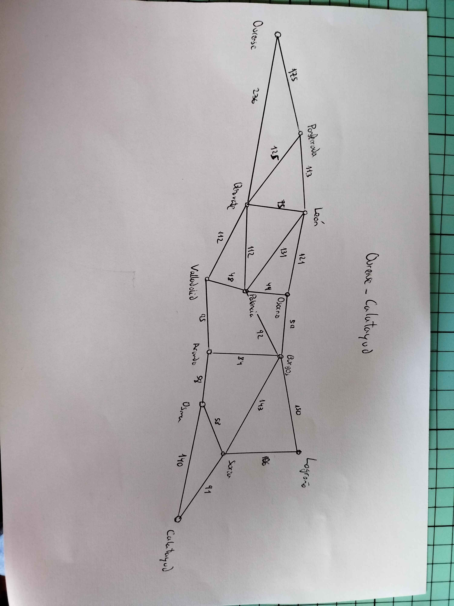

### 1
C {}   

F {Ourense^0}

### 2

C {Ourense^0}   

F {Ponferrada^175 (Ourense), Benavente^236 (Ourense)}

### 3

C {Ourense^0, Ponferrada^175 (Ourense)}  

F {Benavente^236 (Ourense), León^288 (Ponferrada), Benavente^300 (Ponferrada)}

### 4

C {Ourense^0, Ponferrada^175 (Ourense), Benavente^236 (Ourense)}  

F {León^288 (Ponferrada), Benavente^300 (Ponferrada), Ourense^472 (Benvavente), Ponferrada^361 (Benavente), León^311 (Benavente), Palencia^348 (Benavente), Valladolid^348 (Benavente)}

### 5

C {Ourense^0, Ponferrada^175 (Ourense), Benavente^236 (Ourense), León^288 (Ponferrada)}  

F {Benavente^300 (Ponferrada), Ourense^472 (Benvavente), Ponferrada^361 (Benavente), León^311 (Benavente), Palencia^348 (Benavente), Valladolid^348 (Benavente), Ponferrada^401 (León), Benavente^363 (León), Palencia^419 (León), Osorno^409 (León)}

Tacharé los que sean los más bajos que F pero que tienen una versión de coste menor en C

### 6

C {Ourense^0, Ponferrada^175 (Ourense), Benavente^236 (Ourense), León^288 (Ponferrada), Palencia^348 (Benavente)}  

F {~~Benavente^300 (Ponferrada)~~, ~~Ourense^472 (Benvavente)~~, ~~Ponferrada^361 (Benavente)~~, ~~León^311 (Benavente)~~, Valladolid^348 (Benavente), ~~Ponferrada^401 (León), Benavente^363 (León), Palencia^419 (León)~~, Osorno^409 (León), Osorno^397 (Palencia), Burgos^440 (Palencia), León^479 (Palencia), ~~Benavente^460 (Palencia)~~, Valladolid^396 (Palencia)}

### 7

C {Ourense^0, Ponferrada^175 (Ourense), Benavente^236 (Ourense), León^288 (Ponferrada), Palencia^348 (Benavente), Valladolid^396 (Palencia)}  

F {~~Benavente^300 (Ponferrada)~~, ~~Ourense^472 (Benvavente)~~, ~~Ponferrada^361 (Benavente)~~, ~~León^311 (Benavente)~~, ~~Valladolid^348 (Benavente)~~, ~~Ponferrada^401 (León), Benavente^363 (León), Palencia^419 (León)~~, Osorno^409 (León), Osorno^397 (Palencia), Burgos^440 (Palencia), León^479 (Palencia), ~~Benavente^460 (Palencia)~~, ~~Palencia^444 (Valladolid)~~, ~~Benavente^508 (Valladolid)~~, Aranda^491 (Valladolid)}

### 8

C {Ourense^0, Ponferrada^175 (Ourense), Benavente^236 (Ourense), León^288 (Ponferrada), Palencia^348 (Benavente), Valladolid^396 (Palencia), Osorno^397 (Palencia)}  

F {~~Benavente^300 (Ponferrada)~~, ~~Ourense^472 (Benvavente)~~, ~~Ponferrada^361 (Benavente)~~, ~~León^311 (Benavente)~~, ~~Valladolid^348 (Benavente)~~, ~~Ponferrada^401 (León), Benavente^363 (León), Palencia^419 (León)~~, ~~Osorno^409 (León)~~, Burgos^440 (Palencia), ~~León^479 (Palencia)~~, ~~Benavente^460 (Palencia)~~, ~~Palencia^444 (Valladolid)~~, ~~Benavente^508 (Valladolid)~~, Aranda^491 (Valladolid), Burgos^456 (Osorno), ~~León^518 (Osorno)~~, ~~Palencia^446 (Osorno)~~}

### 9

C {Ourense^0, Ponferrada^175 (Ourense), Benavente^236 (Ourense), León^288 (Ponferrada), Palencia^348 (Benavente), Valladolid^396 (Palencia), Osorno^397 (Palencia), Burgos^440 (Palencia)}  

F {~~Benavente^300 (Ponferrada)~~, ~~Ourense^472 (Benvavente)~~, ~~Ponferrada^361 (Benavente)~~, ~~León^311 (Benavente)~~, ~~Valladolid^348 (Benavente)~~, ~~Ponferrada^401 (León), Benavente^363 (León), Palencia^419 (León)~~, ~~Osorno^409 (León)~~, ~~León^479 (Palencia)~~, ~~Benavente^460 (Palencia)~~, ~~Palencia^444 (Valladolid)~~, ~~Benavente^508 (Valladolid)~~, Aranda^491 (Valladolid), ~~Burgos^456 (Osorno)~~, ~~León^518 (Osorno)~~, ~~Palencia^446 (Osorno)~~, ~~Osorno^499 (Burgos)~~, ~~Palencia^532 (Burgos)~~, Logroño^590 (Burgos), Soria^583 (Burgos)}

### 10

C {Ourense^0, Ponferrada^175 (Ourense), Benavente^236 (Ourense), León^288 (Ponferrada), Palencia^348 (Benavente), Valladolid^396 (Palencia), Osorno^397 (Palencia), Burgos^440 (Palencia), Aranda^491 (Valladolid)}  

F {~~Benavente^300 (Ponferrada)~~, ~~Ourense^472 (Benvavente)~~, ~~Ponferrada^361 (Benavente)~~, ~~León^311 (Benavente)~~, ~~Valladolid^348 (Benavente)~~, ~~Ponferrada^401 (León), Benavente^363 (León), Palencia^419 (León)~~, ~~Osorno^409 (León)~~, ~~León^479 (Palencia)~~, ~~Benavente^460 (Palencia)~~, ~~Palencia^444 (Valladolid)~~, ~~Benavente^508 (Valladolid)~~, ~~Burgos^456 (Osorno)~~, ~~León^518 (Osorno)~~, ~~Palencia^446 (Osorno)~~, ~~Osorno^499 (Burgos)~~, ~~Palencia^532 (Burgos)~~, Logroño^590 (Burgos), Soria^583 (Burgos), ~~Valladolid^586 (Aranda), Burgos^575 (Aranda)~~, Osma^549 (Aranda)}

### 11

C {Ourense^0, Ponferrada^175 (Ourense), Benavente^236 (Ourense), León^288 (Ponferrada), Palencia^348 (Benavente), Valladolid^396 (Palencia), Osorno^397 (Palencia), Burgos^440 (Palencia), Aranda^491 (Valladolid), Osma^549 (Aranda)}  

F {~~Benavente^300 (Ponferrada)~~, ~~Ourense^472 (Benvavente)~~, ~~Ponferrada^361 (Benavente)~~, ~~León^311 (Benavente)~~, ~~Valladolid^348 (Benavente)~~, ~~Ponferrada^401 (León), Benavente^363 (León), Palencia^419 (León)~~, ~~Osorno^409 (León)~~, ~~León^479 (Palencia)~~, ~~Benavente^460 (Palencia)~~, ~~Palencia^444 (Valladolid)~~, ~~Benavente^508 (Valladolid)~~, ~~Burgos^456 (Osorno)~~, ~~León^518 (Osorno)~~, ~~Palencia^446 (Osorno)~~, ~~Osorno^499 (Burgos)~~, ~~Palencia^532 (Burgos)~~, Logroño^590 (Burgos), Soria^583 (Burgos), ~~Valladolid^586 (Aranda), Burgos^575 (Aranda)~~, ~~Aranda^607 (Osma)~~, Soria^607 (Osma), Calatayud^689 (Osma)}

### 12

C {Ourense^0, Ponferrada^175 (Ourense), Benavente^236 (Ourense), León^288 (Ponferrada), Palencia^348 (Benavente), Valladolid^396 (Palencia), Osorno^397 (Palencia), Burgos^440 (Palencia), Aranda^491 (Valladolid), Osma^549 (Aranda), Soria^583 (Burgos)}  

F {~~Benavente^300 (Ponferrada)~~, ~~Ourense^472 (Benvavente)~~, ~~Ponferrada^361 (Benavente)~~, ~~León^311 (Benavente)~~, ~~Valladolid^348 (Benavente)~~, ~~Ponferrada^401 (León), Benavente^363 (León), Palencia^419 (León)~~, ~~Osorno^409 (León)~~, ~~León^479 (Palencia)~~, ~~Benavente^460 (Palencia)~~, ~~Palencia^444 (Valladolid)~~, ~~Benavente^508 (Valladolid)~~, ~~Burgos^456 (Osorno)~~, ~~León^518 (Osorno)~~, ~~Palencia^446 (Osorno)~~, ~~Osorno^499 (Burgos)~~, ~~Palencia^532 (Burgos)~~, Logroño^590 (Burgos), ~~Valladolid^586 (Aranda), Burgos^575 (Aranda)~~, ~~Aranda^607 (Osma)~~, ~~Soria^607 (Osma)~~, Calatayud^689 (Osma), Logroño^689 (Soria), Osma^641 (Soria), Calatayud^674}

### 13

C {Ourense^0, Ponferrada^175 (Ourense), Benavente^236 (Ourense), León^288 (Ponferrada), Palencia^348 (Benavente), Valladolid^396 (Palencia), Osorno^397 (Palencia), Burgos^440 (Palencia), Aranda^491 (Valladolid), Osma^549 (Aranda), Soria^583 (Burgos), Logroño^590 (Burgos)}  

F {~~Benavente^300 (Ponferrada)~~, ~~Ourense^472 (Benvavente)~~, ~~Ponferrada^361 (Benavente)~~, ~~León^311 (Benavente)~~, ~~Valladolid^348 (Benavente)~~, ~~Ponferrada^401 (León), Benavente^363 (León), Palencia^419 (León)~~, ~~Osorno^409 (León)~~, ~~León^479 (Palencia)~~, ~~Benavente^460 (Palencia)~~, ~~Palencia^444 (Valladolid)~~, ~~Benavente^508 (Valladolid)~~, ~~Burgos^456 (Osorno)~~, ~~León^518 (Osorno)~~, ~~Palencia^446 (Osorno)~~, ~~Osorno^499 (Burgos)~~, ~~Palencia^532 (Burgos)~~, ~~Valladolid^586 (Aranda), Burgos^575 (Aranda)~~, ~~Aranda^607 (Osma)~~, ~~Soria^607 (Osma)~~, Calatayud^689 (Osma), ~~Logroño^689~~ (Soria), ~~Osma^641 (Soria)~~, Calatayud^674 (Soria), ~~Burgos^740 (Logroño)~~, ~~Soria^696 (Logroño)~~}

### 14

C {Ourense^0, Ponferrada^175 (Ourense), Benavente^236 (Ourense), León^288 (Ponferrada), Palencia^348 (Benavente), Valladolid^396 (Palencia), Osorno^397 (Palencia), Burgos^440 (Palencia), Aranda^491 (Valladolid), Osma^549 (Aranda), Soria^583 (Burgos), Logroño^590 (Burgos), Calatayud^674 (Soria)}  

F {~~Benavente^300 (Ponferrada)~~, ~~Ourense^472 (Benvavente)~~, ~~Ponferrada^361 (Benavente)~~, ~~León^311 (Benavente)~~, ~~Valladolid^348 (Benavente)~~, ~~Ponferrada^401 (León), Benavente^363 (León), Palencia^419 (León)~~, ~~Osorno^409 (León)~~, ~~León^479 (Palencia)~~, ~~Benavente^460 (Palencia)~~, ~~Palencia^444 (Valladolid)~~, ~~Benavente^508 (Valladolid)~~, ~~Burgos^456 (Osorno)~~, ~~León^518 (Osorno)~~, ~~Palencia^446 (Osorno)~~, ~~Osorno^499 (Burgos)~~, ~~Palencia^532 (Burgos)~~, ~~Valladolid^586 (Aranda), Burgos^575 (Aranda)~~, ~~Aranda^607 (Osma)~~, ~~Soria^607 (Osma)~~, Calatayud^689 (Osma), ~~Logroño^689~~ (Soria), ~~Osma^641 (Soria)~~, ~~Burgos^740 (Logroño)~~, ~~Soria^696 (Logroño)~~}